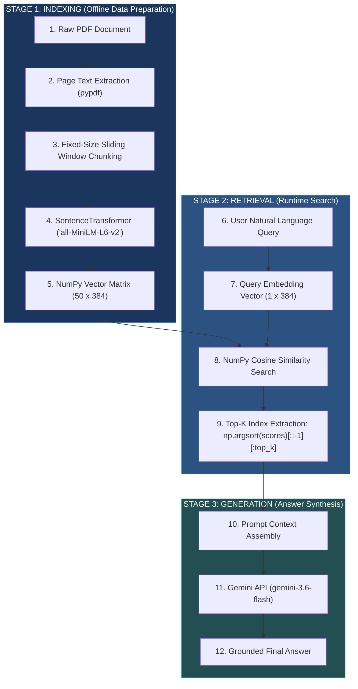
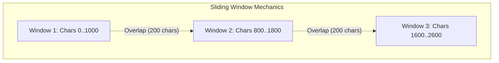
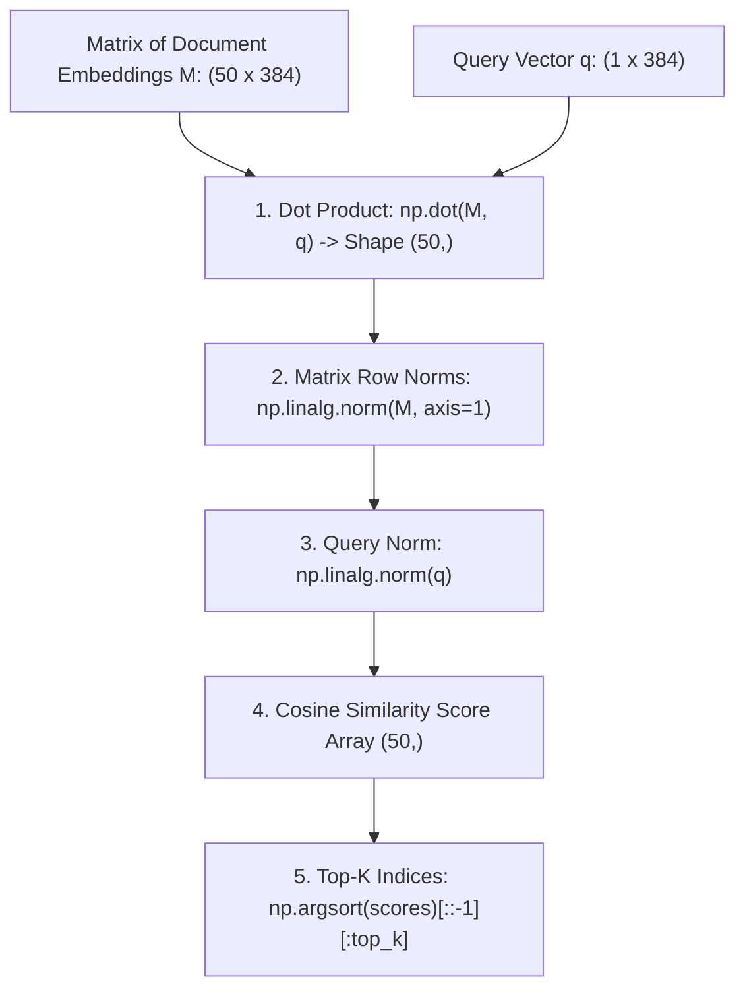
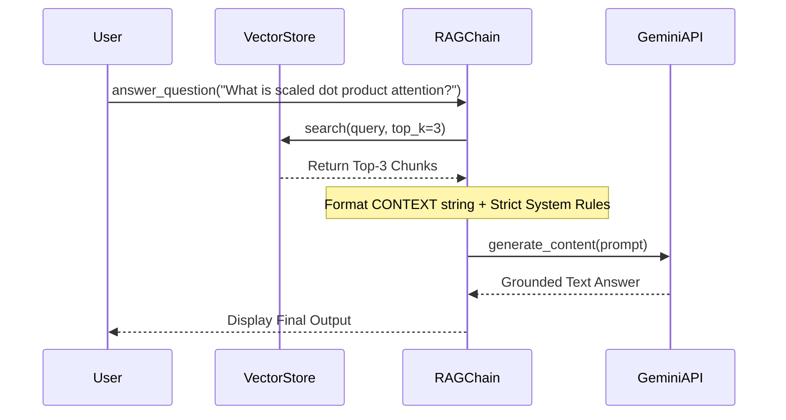

# Engineering Learnings: RAG from Scratch

A comprehensive engineering reference capturing first-principles intuition, mathematical formulas, system architecture diagrams, and empirical findings from building a baseline RAG pipeline.

---

## 1. End-to-End System Architecture



---

## 2. Document Processing & Sliding Window Chunking

### Core Intuition
Rather than embedding an entire 15-page PDF into a single vector (which causes **semantic dilution**), we segment the text into focused passages (chunks).



### Mathematical Formula
For a given `chunk_size` and `chunk_overlap`:
$$\text{step} = \text{chunk\_size} - \text{chunk\_overlap}$$

> [!WARNING]
> **Empirical Failure Mode: Fixed Character Slicing**
> Slicing text strictly at character index `1000` disregards word and sentence boundaries. 
> * **Observed Output:** `"...dispensing with recurrence and convolutions entirely. Exper"` in Chunk 0, and `"iments on two machine..."` in Chunk 1.
> * **Impact:** Severing `"Experiments"` into `"Exper"` and `"iments"` degrades tokenizer vocabulary matching, drops vector cosine similarity scores, and confuses the LLM context window.

---

## 3. Dense Vector Embeddings & Similarity Search (Pure NumPy)

Embedding models transform raw text into $D$-dimensional dense floating-point arrays ($\mathbb{R}^{384}$).



### Mathematical Formulations

1. **Dot Product:**
   $$\text{dot\_p} = M \cdot \vec{q} = \sum_{j=1}^{D} M_{i, j} \cdot q_j$$

2. **Euclidean Norm (Magnitude):**
   $$\|M_i\|_2 = \sqrt{\sum_{j=1}^{D} M_{i, j}^2}$$

3. **Cosine Similarity:**
   $$\text{sim}(M_i, \vec{q}) = \frac{M_i \cdot \vec{q}}{\|M_i\|_2 \|\vec{q}\|_2}$$

4. **Top-K Indexing Chain:**
   ```python
   top_indices = np.argsort(scores)[::-1][:top_k]
   ```
   * `np.argsort(scores)` $\to$ Returns indices sorted ascending (lowest score first).
   * `[::-1]` $\to$ Reverses array to descending order (highest score first).
   * `[:top_k]` $\to$ Slices the top $K$ best matching index positions.

---

## 4. RAG Prompt Assembly & LLM Generation

To prevent hallucinations, the retrieved top $K$ passages are structured into an explicit system prompt.



> [!IMPORTANT]
> **Prompt Grounding Rule:**
> Always instruct the LLM to rely *strictly* on the provided `CONTEXT` block and to reply with *"I cannot find the answer in the provided document"* if the context lacks the required information.

---

## 5. Repository File Map

| Component | File Link | Description |
| :--- | :--- | :--- |
| **Chunker** | [chunking.py](file:///c:/Users/91801/Documents/GitHub/RAG/chunking.py) | PDF text extraction (`pypdf`) + sliding window chunking loop. |
| **Vector Store** | [vector_store.py](file:///c:/Users/91801/Documents/GitHub/RAG/vector_store.py) | `SentenceTransformer` embeddings + pure NumPy Cosine Similarity engine. |
| **RAG Chain** | [rag_chain.py](file:///c:/Users/91801/Documents/GitHub/RAG/rag_chain.py) | End-to-end RAG pipeline connecting vector search to Gemini 3.6 Flash. |
| **Test Harness** | [test_pipeline.py](file:///c:/Users/91801/Documents/GitHub/RAG/test_pipeline.py) | Verification script for indexing & vector retrieval. |

---

## 6. Verified End-to-End Execution Benchmark

* **Source Document:** *Attention Is All You Need* (`1706.03762v7.pdf`)
* **Question:** *"What is the formula for Scaled Dot-Product Attention, and why is scaling by sqrt(d_k) necessary?"*
* **Vector Match Score:** `0.5772` (Top Rank)
* **Generated Answer:**

> * **Formula for Scaled Dot-Product Attention:**  
>   $$\text{Attention}(Q, K, V) = \text{softmax}\left(\frac{QK^T}{\sqrt{d_k}}\right)V$$
> 
> * **Why scaling by $\sqrt{d_k}$ is necessary:**  
>   For large values of $d_k$, the dot products grow large in magnitude, which pushes the softmax function into regions that have extremely small gradients. Scaling the dot products by $\frac{1}{\sqrt{d_k}}$ counteracts this effect.
